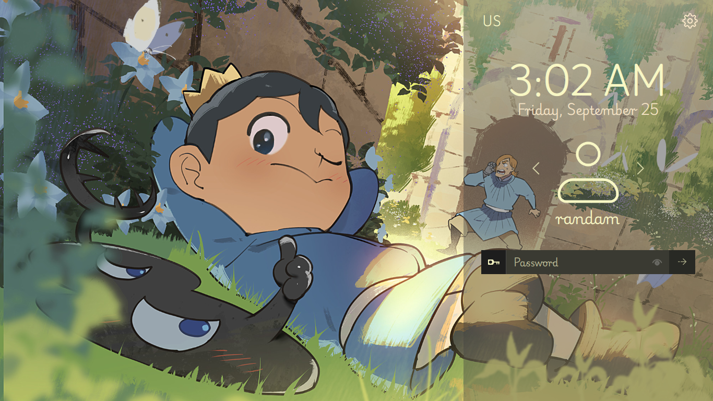
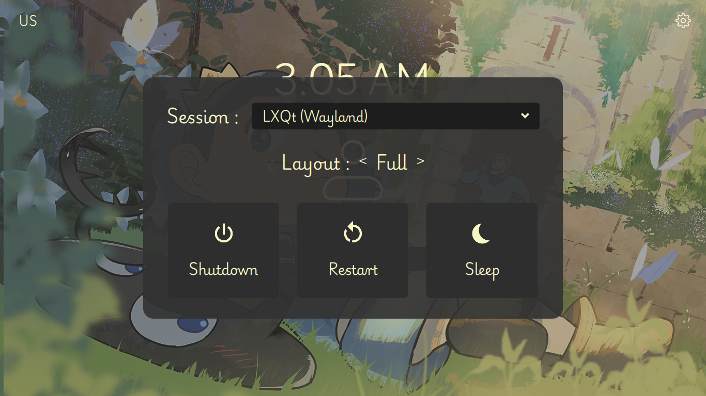

# Ranking Kings — SDDM Theme

An SDDM greeter theme inspired by *Ranking of Kings* (Ousama Ranking), built with QML/QtQuick. Includes a 4-way animated layout engine and an integrated settings/power modal.

---

## Previews

| Right Layout (Default) | Settings Modal & Power Menu |
| :---: | :---: |
|  |  |

---

## Features

- **4 Layout Options**: Switch between `Right`, `Left`, `Center`, and `Full`, with smooth transitions.
- **Settings Modal**:
  - Session selector — detects installed desktop sessions (Openbox, LXQt, Plasma Wayland, Hyprland, etc.)
  - Layout switcher — change login panel placement from the UI
  - Power controls — Shutdown, Restart, Sleep
- **Multi-User Switcher**: Cycle between users; loads `~/.face.icon` where available, with a fallback avatar.
- **Keyboard Layout Indicator**: Detects layout switches (e.g. Alt+Shift); click to cycle manually.
- **Configurable via `theme.conf`**: Colors, opacity, and backgrounds can be changed without editing QML.
- **Live Clock & Date**.

---

## Project Structure

```text
ranking-kings-sddm/
├── metadata.desktop
├── theme.conf
├── Main.qml
└── assets/
    ├── wallpaper.jpg
    ├── fonts/
    │   ├── main.ttf         # Playwrite US Modern
    │   └── second.ttf       # Overpass Mono
    └── icons/
        ├── arrow-left-big.svg
        ├── arrow-right-big.svg
        ├── drop.svg
        ├── eye.svg
        ├── key.svg
        ├── profile.svg
        ├── restart.svg
        ├── settings.svg
        ├── shutdown.svg
        ├── sleep.svg
        └── submit.svg
```

---

## Installation

**1. Copy the theme into SDDM's themes directory:**

```bash
sudo cp -r /path/to/Theme /usr/share/sddm/themes/ranking-kings
sudo chmod -R a+rX /usr/share/sddm/themes/ranking-kings
```

**2. Set it as the active theme.**

Edit `/etc/sddm.conf` (or create `/etc/sddm.conf.d/theme.conf`):

```ini
[Theme]
Current=ranking-kings
```

---

## Testing

Test without logging out or rebooting:

**Qt5:**
```bash
sddm-greeter --test-mode --theme /usr/share/sddm/themes/ranking-kings
```

**Qt6 (Plasma 6 / modern distros):**
```bash
sddm-greeter-qt6 --test-mode --theme /usr/share/sddm/themes/ranking-kings
```

---

## Customization

Edit `theme.conf` to change the color scheme:

```ini
[General]
panelBg=#663f3f3f
textPrimary=#f8f7c4
textSecondary=#f6e4c5
textMuted=#b3f8f7c4
inputBg=#3a3a32
keyBg=#1d1d1d
submitBg=#282924
dividerColor=#33ffffff
modalBg=#e6323232
modalCardBg=#2e2e2e
```

---

## Typography & Credits

- **Primary font**: [Playwrite US Modern](https://fonts.google.com/specimen/Playwrite+US+Modern) (SIL Open Font License)
- **Monospace font**: [Overpass Mono](https://fonts.google.com/specimen/Overpass+Mono) by Red Hat & Delve Fonts (SIL Open Font License)
- **Artwork**: Characters Bojji, Kage, and Domas from *Ranking of Kings* (Ousama Ranking / 劇団WIT / Sousuke Tooka). If you're the original artist of this wallpaper, please open an issue or get in touch so I can credit it properly.

---

## License

Licensed under the [MIT License](LICENSE).
